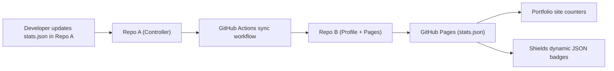

# StatsSync Controller

This repository holds the source of truth for my practice statistics and the workflow that synchronizes them to my GitHub profile.

## Architecture Diagram

**Goal**  
Keep three practice metrics in sync across my GitHub profile and portfolio site by editing a single file once per day.

**Key metrics**
- Projects completed
- CodeSignal practice problems solved
- LeetCode problems solved

**Architecture overview**

- **Repo A (controller)**
  - Contains `stats.json` as the single source of truth for the three metrics.
  - A GitHub Actions workflow runs on push to `stats.json`.
  - The workflow:
    - checks out Repo A
    - clones Repo B using a fine-grained personal access token
    - copies `stats.json` into the root of Repo B
    - commits and pushes only if the file has changed

- **Repo B (profile)**
  - GitHub profile repo: `AmjadKudsi/AmjadKudsi`.
  - GitHub Pages is enabled.
  - Serves `stats.json` at  
    `https://amjadkudsi.github.io/AmjadKudsi/stats.json`.
  - README uses Shields dynamic JSON badges to display the metrics.

- **Consumers**
  - GitHub profile badges (Shields dynamic JSON).
  - Portfolio website, which fetches the same `stats.json` and animates the counters in the UI.

**Data and deployment flow**

1. I edit the three numbers in `stats.json` in Repo A and push.
2. The sync workflow in Repo A updates `stats.json` in Repo B if there is any change.
3. A single commit in Repo B triggers one GitHub Pages deployment.
4. Both the profile badges and the portfolio site read the updated values from the same JSON endpoint.

**Design principles**

- Single source of truth (only one file to edit).
- Separation of concerns:
  - Repo A controls data and sync.
  - Repo B handles profile and hosting.
- Clean deployments:
  - Repo B gets only one commit per update, so older deployments are not cancelled.
- Consistent views:
  - All clients read from the same JSON file served by GitHub Pages.
