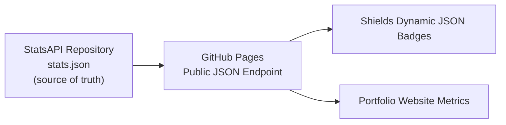
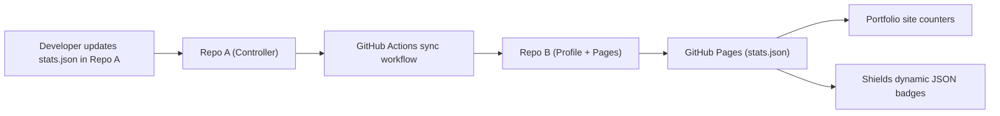

# StatsAPI

## Technical Report Repository  
## Author: Amjad Kudsi  

---

## Architecture Diagram

## Overview

StatsAPI provides a lightweight and version controlled public metrics endpoint backed by GitHub Pages. It exposes a single JSON document containing numerical indicators used by external user interfaces such as a portfolio website and GitHub profile badges.

This design removes the need to redeploy frontend applications when updating these values and ensures consistency across all consumers by maintaining a single authoritative data source.

---

## Repository Contents

- `stats.json`  
  Canonical data file representing the latest metric values.

- `StatsAPI.pdf`  
  Detailed documentation of the system design, rationale, and architectural evolution.

- `README.md` (this document)  
  High-level overview suitable for GitHub visitors, recruiters, and technical reviewers.

---

## System Architecture

StatsAPI operates as a standalone repository that:

1. Maintains metrics in `stats.json`.  
2. Publishes the JSON file via GitHub Pages at a stable HTTPS URL:  
   `https://amjadkudsi.github.io/StatSync-Controller/stats.json`  
3. Serves as the data source for multiple downstream systems:
   - Shields dynamic JSON badges in the GitHub profile  
   - Portfolio website counters that fetch the same endpoint  

This configuration provides a unified and reliable data access layer.

---

## Data Flow Summary

1. `stats.json` is updated manually.  
2. GitHub Pages automatically redeploys the repository.  
3. Consumer systems fetch the updated metrics from the public endpoint.  
4. No frontend redeployment or manual synchronization is required.

---

## Key Properties

- **Single Source of Truth**  
  All consumer systems read the same JSON document, ensuring consistency.

- **No Redeployment Overhead**  
  Frontend applications remain untouched; only this repository is updated.

- **Stable Public Interface**  
  The JSON file functions as a lightweight API that is accessible over HTTPS.

- **Deterministic Deployments**  
  One commit triggers one deployment, with no cross-repository workflows.

---

## Consumers

- [**GitHub Profile**](https://github.com/AmjadKudsi#-socials)  
  Displays metric badges powered by Shields dynamic JSON queries referencing the StatsAPI endpoint.

- **Portfolio Website**  
  Fetches and animates the metric values through client-side JavaScript using the same endpoint.

Both surfaces remain fully synchronized with no manual coordination.

---

## Previous Architecture (StatsSync)

